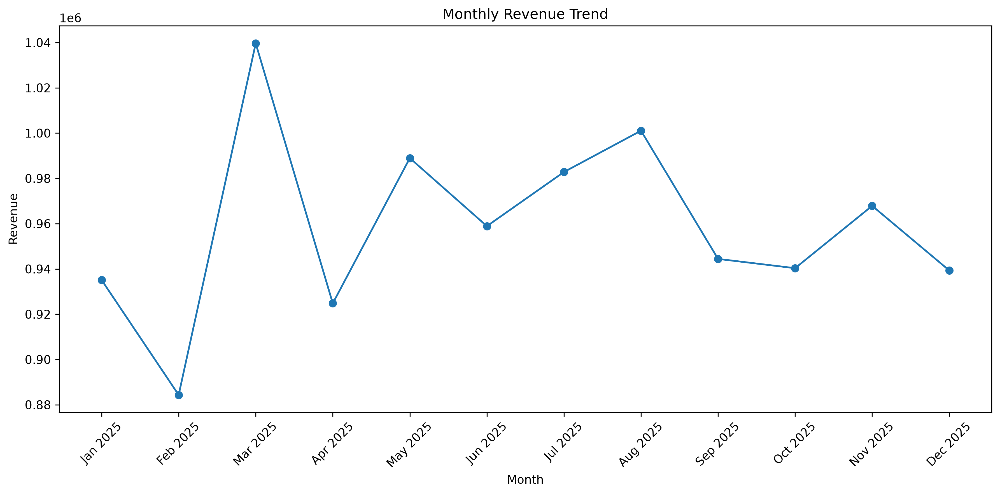
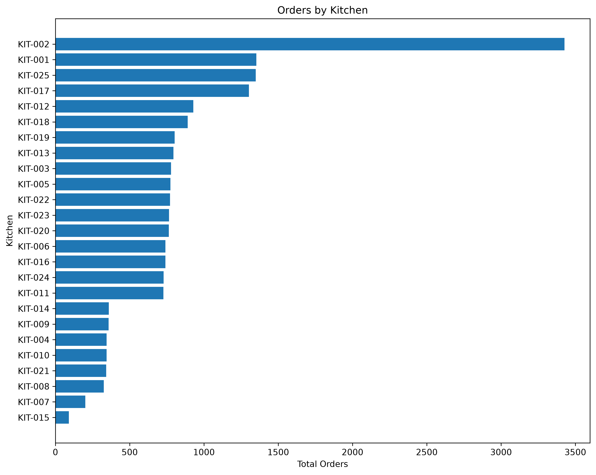
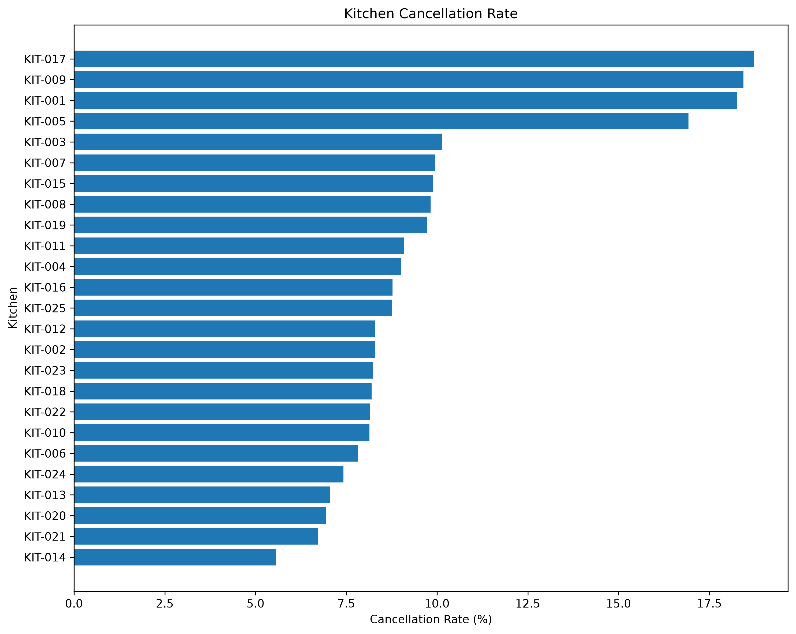
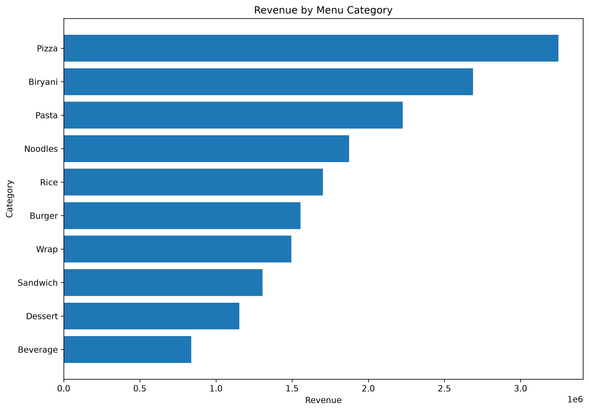
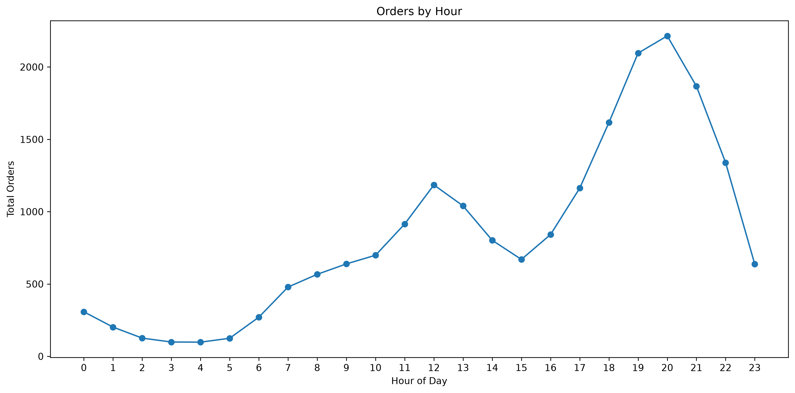
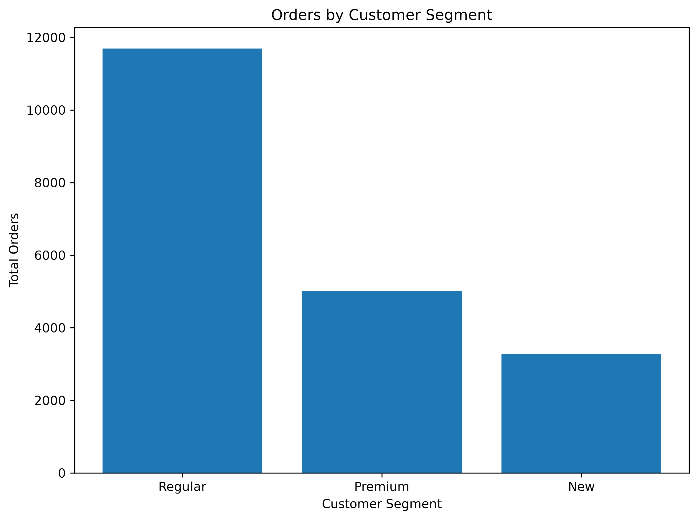

# Urban Ghost Kitchen Analytics

An end-to-end data analytics case study on a synthetic ghost kitchen and food delivery operation, covering data cleaning, feature engineering, SQL-based business analysis, Python/MySQL integration, and validated business insights across customer, revenue, kitchen, delivery, menu, segmentation, cancellation, and time-based dimensions.

---

## Table of Contents

1. [Project Overview](#project-overview)
2. [Business Problem](#business-problem)
3. [Business Objectives](#business-objectives)
4. [Business Questions](#business-questions)
5. [Dataset Overview](#dataset-overview)
6. [Data Model](#data-model)
7. [Technology Stack](#technology-stack)
8. [Project Workflow](#project-workflow)
9. [Data Cleaning](#data-cleaning)
10. [Feature Engineering](#feature-engineering)
11. [MySQL Database](#mysql-database)
12. [SQL Analysis](#sql-analysis)
13. [Python + SQL Integration](#python--sql-integration)
14. [SQL vs Pandas Validation](#sql-vs-pandas-validation)
15. [Business Findings](#business-findings)
16. [Visual Analysis](#visual-analysis)
17. [Business Opportunities](#business-opportunities)
18. [Data Quality Findings](#data-quality-findings)
19. [Project Limitations](#project-limitations)
20. [Repository Structure](#repository-structure)
21. [How to Run the Project](#how-to-run-the-project)
22. [Key Skills Demonstrated](#key-skills-demonstrated)
23. [Final Summary](#final-summary)

---

## Project Overview

This project analyzes operational and business data from a synthetic ghost kitchen network called **Urban Ghost Kitchen**. A ghost kitchen operates without a physical dine-in space, fulfilling orders exclusively through delivery. The project simulates the kind of data an analytics team at such a business would work with: customer records, kitchen-level operations, order transactions, and menu-item detail.

The work follows a complete analytics lifecycle: raw data inspection, profiling, cleaning, feature engineering, relational database loading, SQL-based business analysis, and cross-validation between SQL and Pandas outputs. The goal is to demonstrate a realistic, evidence-based analytical process rather than a single dashboard or isolated script.

All data in this project is **synthetic** and was generated for portfolio and analytical practice purposes. Urban Ghost Kitchen is not a real company.

---

## Business Problem

A ghost kitchen network generates high order volume but has no single, unified view of where cancellations, refunds, and delivery delays are concentrated, or which kitchens, customer segments, and menu categories are driving (or dragging on) revenue. Without this visibility, operational and pricing decisions would have to be made without evidence.

This project addresses that gap by building a structured, queryable analytics layer on top of the raw operational data.

---

## Business Objectives

- Quantify order volume, revenue, and cancellation/refund behavior across the network.
- Identify which kitchens and customer segments contribute the most (and least) to revenue and cancellations.
- Understand how delivery time and distance relate to order outcomes.
- Determine which menu categories and items drive revenue, and why.
- Establish a time-based demand pattern to inform capacity planning.
- Validate that SQL-based and Pandas-based calculations produce consistent results.

---

## Business Questions

1. What share of orders are delivered, cancelled, or refunded, and how much revenue does each status represent?
2. Which kitchens generate the most orders and revenue, and which have unusually high cancellation rates?
3. How does delivery time vary by distance category, and are there kitchen-level outliers?
4. Which menu categories and items generate the most revenue, and is that driven by price or by volume?
5. How do New, Regular, and Premium customer segments differ in order value, spend, and cancellation behavior?
6. Are cancellation-prone kitchens the same as refund-prone kitchens?
7. When does order demand peak during the day and week?
8. Do the customer master data and order data reconcile in terms of unique customer counts?

---

## Dataset Overview

The project uses four relational datasets, all cleaned prior to analysis.

| Dataset | Records | Description |
|---|---:|---|
| `customers.csv` | 1,000 | Customer identifiers and profile information |
| `kitchens.csv` | 25 | Ghost kitchen identifiers and operational information |
| `orders.csv` | 20,000 | Order-level transaction, revenue, delivery, and status information |
| `menu_items.csv` | 45,000 | Line-item detail for items contained in each order |

---

## Data Model

The datasets are related through the following keys:

```
customers.customer_id  →  orders.customer_id
kitchens.kitchen_id    →  orders.kitchen_id
orders.order_id        →  menu_items.order_id
```

This forms a standard star-like structure with `orders` as the central fact table, `customers` and `kitchens` as dimension tables, and `menu_items` as an order-level detail table.

---

## Technology Stack

| Category | Tools |
|---|---|
| Programming | Python, SQL |
| Data Handling | Pandas |
| Visualization | Matplotlib |
| Database | MySQL |
| Database Connectivity | SQLAlchemy |
| Development Environment | Jupyter Notebook |
| Reporting Output | Excel |
| Version Control | Git, GitHub |

This project does not use Power BI. All analysis and reporting outputs are produced through Python, SQL, and Excel.

---

## Project Workflow

The project follows a linear analytics pipeline:

```
Raw Data → Profiling → Cleaning → Feature Engineering →
MySQL Load → SQL Analysis → Python/SQL Validation →
Business Findings → Charts → Excel Outputs
```

Each stage is implemented in a dedicated notebook or script, described in the sections below.

---

## Data Cleaning

The raw data contained realistic data-quality issues typical of operational datasets, including:

- Duplicate records
- Missing values
- Whitespace inconsistencies
- Inconsistent capitalization
- Mixed date formats
- Invalid negative values
- Invalid zero values
- Category inconsistencies
- Order-status inconsistencies
- Primary-key issues
- Foreign-key issues
- Statistical outliers

Cleaning was performed using Python and Pandas, following this workflow:

1. Data loading
2. Data profiling
3. Duplicate detection
4. Missing-value treatment
5. Text standardization
6. Date conversion
7. Numeric validation
8. Category standardization
9. Primary-key validation
10. Foreign-key validation
11. Outlier review
12. Final validation
13. Export of cleaned datasets

**Note on outliers:** not every extreme value was removed. Statistical outliers were reviewed individually, and values judged to be legitimate (e.g., genuinely high-spend or high-frequency customers) were retained rather than deleted. This distinction is preserved throughout the analysis — extreme values in the findings below reflect retained, reviewed data rather than uncleaned noise.

---

## Feature Engineering

New analytical features were derived from the cleaned data to support the business analysis.

**Time features**
- `order_year`, `order_month`, `order_month_name`
- `order_day`, `order_day_name`, `order_hour`
- `is_weekend`

**Order features**
- `gross_amount`
- `total_customer_charge`
- `discount_percentage`
- `delivery_cost_per_km`
- `delivery_speed_km_per_min`

**Delivery categories**
- Time-based: `Fast`, `Moderate`, `Slow`
- Distance-based: `Short`, `Medium`, `Long`

**Customer-level features**
- `total_orders`, `total_spend`, `average_order_value`
- `total_discount`, `total_delivery_fee`
- `average_delivery_time`
- `delivered_orders`, `cancelled_orders`, `refunded_orders`

**Kitchen-level features**
- `total_orders`, `total_revenue`
- `average_order_value`
- `average_delivery_time`, `average_delivery_distance`
- `cancelled_orders`, `refunded_orders`

**Menu-level features**
- `total_quantity_sold`, `total_sales`
- `average_unit_price`
- `distinct_order_count`

---

## MySQL Database

The cleaned, feature-engineered datasets were loaded into a MySQL database to support relational, SQL-based analysis. Database setup and table creation are defined in `sql/01_database_setup.sql`, with referential integrity checked in `sql/02_data_validation.sql`.

Python connects to this database using **SQLAlchemy**, allowing SQL query results to be pulled directly into Pandas DataFrames for further validation and export.

---

## SQL Analysis

SQL was used to answer the core business questions directly against the relational data. Analysis was organized into nine areas:

1. Customer Analysis
2. Revenue Analysis
3. Order Analysis
4. Kitchen Performance Analysis
5. Delivery Performance Analysis
6. Menu Category Analysis
7. Customer Segmentation Analysis
8. Cancellation and Refund Analysis
9. Time-Based Analysis

All queries for this stage are defined in `sql/03_business_analysis.sql`.

Example query — overall order status breakdown:

```sql
SELECT
    order_status,
    COUNT(*) AS total_orders,
    ROUND(COUNT(*) * 100.0 / SUM(COUNT(*)) OVER (), 2) AS status_percentage
FROM orders
GROUP BY order_status
ORDER BY total_orders DESC;
```

Example query — cancellation rate by kitchen:

```sql
SELECT
    kitchen_id,
    COUNT(*) AS total_orders,
    SUM(order_status = 'Cancelled') AS cancelled_orders,
    ROUND(SUM(order_status = 'Cancelled') * 100.0 / COUNT(*), 2) AS cancellation_rate
FROM orders
GROUP BY kitchen_id
ORDER BY cancellation_rate DESC;
```

---

## Python + SQL Integration

Python was connected to MySQL using SQLAlchemy to programmatically retrieve query results into Pandas for further processing, validation, and export to Excel.

```python
from sqlalchemy import create_engine, text
import pandas as pd

engine = create_engine(
    "mysql+pymysql://<user>:<password>@<host>:<port>/<database>"
)

query = """
    SELECT order_status, COUNT(*) AS total_orders
    FROM orders
    GROUP BY order_status
"""

with engine.connect() as connection:
    df = pd.read_sql_query(text(query), connection)
```

This integration is implemented in `scripts/mysql_connection.py`, `scripts/import_to_mysql.py`, and `scripts/retrieve_analysis_results.py`.

---

## SQL vs Pandas Validation

To confirm analytical consistency, core order-status metrics were computed independently in both SQL and Pandas and compared directly.

| Metric | SQL | Pandas |
|---|---:|---:|
| Total Orders | 20,000 | 20,000 |
| Delivered Orders | 17,162 | 17,162 |
| Cancelled Orders | 2,038 | 2,038 |
| Refunded Orders | 800 | 800 |

The SQL and Pandas results matched exactly for all validated metrics above, confirming that the SQL analysis layer and the Pandas-based feature engineering layer are consistent with one another. Validation logic is implemented in `scripts/validate_sql_pandas.py`.

---

## Business Findings

The findings below are drawn directly from the SQL and Pandas analysis. Where the data shows a pattern without an identifiable cause, this is stated explicitly rather than implied as a conclusion.

### Order Status

| Status | Orders | Share |
|---|---:|---:|
| Delivered | 17,162 | 85.81% |
| Cancelled | 2,038 | 10.19% |
| Refunded | 800 | 4.00% |
| **Total** | **20,000** | **100%** |

The overall cancellation rate is 10.19% and the refund rate is 4.00%.

### Kitchen Performance

Kitchen order volume was highly uneven across the network. **KIT-002** recorded the highest order volume and revenue in the dataset:

- 3,427 orders
- ₹1,949,309.57 revenue

The kitchens with the highest cancellation rates were:

| Kitchen | Approx. Cancellation Rate |
|---|---:|
| KIT-017 | ~17–19% |
| KIT-009 | ~17–19% |
| KIT-001 | ~17–19% |
| KIT-005 | ~17–19% |

These four kitchens cancel orders at roughly double the network-wide rate of 10.19%. The dataset does not indicate *why* these specific kitchens have higher cancellation rates — this is a pattern that suggests an area for further operational investigation, not a causal finding.

### Menu Performance

Pizza was the top-performing category by revenue:

- Revenue: approximately ₹3.25 million
- Quantity sold: 8,938 units
- Average unit price: ₹363.34

Across menu categories, order quantity was relatively similar, while revenue varied substantially. Category revenue differences were strongly associated with differences in average unit price. This is an observed association in the data, not a formal decomposition — it is not claimed that price differences fully explain the revenue gap between categories.

### Customer Analysis

The highest-spending customer in the dataset was **CUS-00582**:

- 276 orders
- ₹156,944.26 total spend
- Approximately 1.36% of total revenue

No customer among the top 20 by spend contributed more than approximately 1.4% of total revenue, indicating that revenue is spread across the customer base rather than concentrated in a small number of accounts.

### Customer Segmentation

| Segment | Average Order Value | Average Customer Spend |
|---|---:|---:|
| Premium | ₹577.59 | ₹19,720.55 |
| Regular | ₹575.33 | ₹12,278.32 |
| New | ₹572.20 | ₹6,597.31 |

Average order value is nearly identical across segments (within about 1%), while average customer spend differs substantially. This indicates that spend differences between segments are driven by order frequency rather than basket size.

New customers had a cancellation rate of approximately 11.14%, the highest of the three segments.

### Delivery

| Distance Category | Average Delivery Time |
|---|---:|
| Short | 20.45 minutes |
| Medium | 34.49 minutes |
| Long | 57.81 minutes |
| **Overall Average** | **29.31 minutes** |

Delivery time increases with distance category, as would be expected. The dataset also shows kitchen-level delivery-time outliers that do not track distance alone — this is noted as an observation; the analysis does not conclude that geography independently determines a kitchen's delivery performance.

### Time Analysis

- Orders placed between 18:00 and 21:00 represented approximately 33.7% of total order volume.
- 20:00 was the single busiest order hour in the dataset.
- Order demand was also higher on weekends than on individual weekdays.

This is one of the more consistent and actionable patterns in the dataset, given how narrow and repeatable the peak window is.

---

## Visual Analysis

Six charts were produced using Matplotlib to support the findings above. Each chart is placed alongside its related analysis.

**Monthly Revenue** — supports the time-based revenue pattern across the year.



**Orders by Kitchen** — supports the finding that order volume is highly uneven across the kitchen network.



**Cancellation Rate by Kitchen** — supports the identification of KIT-017, KIT-009, KIT-001, and KIT-005 as the highest-cancellation kitchens.



**Revenue by Menu Category** — supports the finding that Pizza leads category revenue.



**Orders by Hour** — supports the finding that demand peaks between 18:00 and 21:00, with 20:00 as the busiest hour.



**Orders by Customer Segment** — supports the segmentation findings on order behavior across New, Regular, and Premium customers.



---

## Business Opportunities

The following are areas the analysis suggests are worth further investigation. These are opportunities for follow-up work, not proven causal findings, and are presented separately from the business findings above.

1. **Investigate high-cancellation kitchens.** KIT-017, KIT-009, KIT-001, and KIT-005 show cancellation rates roughly double the network average — worth a targeted operational review rather than a network-wide initiative.
2. **Review menu pricing and category strategy.** Category revenue differences track closely with average unit price differences, suggesting pricing and category mix are worth examining further.
3. **Prepare kitchen and delivery capacity for evening demand.** The 18:00–21:00 window consistently accounts for roughly a third of daily order volume.
4. **Investigate new-customer cancellation behavior.** New customers show the highest cancellation rate of the three segments, at approximately 11.14%.
5. **Reconcile the 20 customers without recorded orders.** See [Data Quality Findings](#data-quality-findings) below.
6. **Analyze cancellation and refund issues separately.** The kitchens with the highest cancellation rates are not the same kitchens with the highest refund rates, indicating these may be distinct operational issues rather than a single shared cause.

---

## Data Quality Findings

During validation, a discrepancy was identified between the customer master data and the order data:

- The customer master (`customers.csv`) contains **1,000** customers.
- The order data (`orders.csv`) contains **980** unique customers with at least one recorded order.

This means approximately **20 customers** in the master dataset have no recorded orders. This is presented as a data reconciliation finding rather than a business conclusion — the dataset does not indicate whether these are new customers who have not yet ordered, inactive accounts, or a data-loading discrepancy. Resolving this gap is listed as a business opportunity above.

---

## Project Limitations

- All data is synthetic; findings describe patterns within this dataset only and are not generalizable to any real business.
- Cancellation and delivery-time patterns identified across kitchens and segments are correlational observations, not causal conclusions. No experiment or controlled comparison was performed to isolate cause.
- Outlier review was based on analyst judgment applied to the available fields; it does not guarantee that every retained extreme value reflects a genuine business event.
- No forecasting, statistical significance testing, or machine learning was performed as part of this project.
- The analysis reflects a single historical period represented in the dataset and does not account for seasonality beyond what is directly observable within that period.

---

## Repository Structure

```
urban-ghost-kitchen/
│
├── data/
│   ├── raw/
│   ├── cleaned/
│   └── analysis_ready/
│
├── notebooks/
│   ├── 01_data_load_and_inspect.ipynb
│   ├── 02_data_profiling.ipynb
│   ├── 03_data_cleaning.ipynb
│   ├── 04_feature_engineering.ipynb
│   └── 05_business_analysis.ipynb
│
├── sql/
│   ├── 01_database_setup.sql
│   ├── 02_data_validation.sql
│   └── 03_business_analysis.sql
│
├── scripts/
│   ├── mysql_connection.py
│   ├── import_to_mysql.py
│   ├── retrieve_analysis_results.py
│   ├── validate_sql_pandas.py
│   ├── create_final_analysis_tables.py
│   └── create_analysis_charts.py
│
├── outputs/
│   ├── tables/
│   ├── charts/
│   └── insights/
│
├── .env.example
├── .gitignore
├── requirements.txt
└── README.md
```

---

## How to Run the Project

1. **Clone the repository**
   ```bash
   git clone https://github.com/aranna20/urban-ghost-kitchen.git
   cd urban-ghost-kitchen
   ```

2. **Create and activate a virtual environment**
   ```bash
   python -m venv venv
   source venv/bin/activate   # Windows: venv\Scripts\activate
   ```

3. **Install dependencies**
   ```bash
   pip install -r requirements.txt
   ```

4. **Configure database credentials**
   Copy `.env.example` to `.env` and fill in your MySQL connection details:
   ```
   MYSQL_USER=your_username
   MYSQL_PASSWORD=your_password
   MYSQL_HOST=localhost
   MYSQL_PORT=3306
   MYSQL_DATABASE=urban_ghost_kitchen
   ```

5. **Set up the database**
   ```bash
   mysql -u your_username -p < sql/01_database_setup.sql
   python scripts/import_to_mysql.py
   mysql -u your_username -p < sql/02_data_validation.sql
   ```

6. **Run the notebooks in order**
   Execute `notebooks/01` through `notebooks/05` sequentially to reproduce data cleaning, feature engineering, and business analysis.

7. **Run SQL analysis and validation scripts**
   ```bash
   mysql -u your_username -p < sql/03_business_analysis.sql
   python scripts/retrieve_analysis_results.py
   python scripts/validate_sql_pandas.py
   ```

8. **Generate final tables and charts**
   ```bash
   python scripts/create_final_analysis_tables.py
   python scripts/create_analysis_charts.py
   ```

Outputs (tables, charts, and insight summaries) will be written to the `outputs/` directory.

---

## Key Skills Demonstrated

- Data profiling and structured data-quality assessment
- Data cleaning with Pandas (duplicates, missing values, text/date standardization, key validation, outlier review)
- Feature engineering for time-based, order-level, customer-level, and kitchen-level analysis
- Relational database design and loading in MySQL
- Business-question-driven SQL analysis (aggregation, grouping, window functions)
- Python-to-SQL integration using SQLAlchemy
- Cross-validation of analytical results between SQL and Pandas
- Data visualization with Matplotlib
- Clear separation of data-supported findings from unproven causal claims
- End-to-end analytics project structuring and documentation

---

## Final Summary

This project analyzes a synthetic ghost kitchen operation across nine business dimensions using a full data-analytics pipeline: profiling and cleaning raw data, engineering analytical features, loading data into MySQL, answering business questions with SQL, and cross-validating results with Pandas. Cancellation and revenue patterns were traced to specific kitchens and customer segments, category revenue differences were linked to pricing, and a customer-data reconciliation gap was identified during validation. Findings are presented as evidence-based observations, with correlational patterns explicitly distinguished from proven causes, and open questions listed as business opportunities for further investigation rather than settled conclusions.
